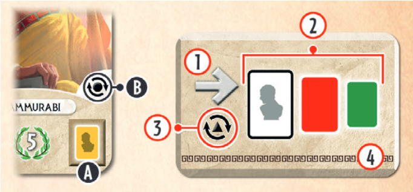

# 《七大奇蹟：對決》的單人遊戲規則。

### 概述
這套「即印即玩」（Print & Play）的規則讓你能夠獨自遊玩《七大奇蹟：對決》。在遊戲中，你將面對五個傳奇對手之一，每位對手都有其獨特的策略。但要小心，想贏並不容易！

遊戲內容物包括：
* 12 張決策卡
* 5 張領袖卡

> 可以使用 PNP 列印卡牌遊玩，也可以考慮使用 [Web APP](https://app.boardandgamer.com/7wonders-duel-solo/) 進行遊玩。

---

### 設定
1. 像正常遊戲一樣設定第一紀元的卡牌，但你的位置要面向卡牌結構的第一排。
2. 你的城市區域在卡牌結構的左側，領袖的城市區域在右側。
3. 給自己 7 枚硬幣，領袖則沒有。
4. 將領袖卡洗牌並抽取一張，這將是你將要面對的領袖，並將其放置在領袖的城市區域。其餘的領袖卡在遊戲中將不會被使用。
5. 根據你抽到的領袖卡，將上面顯示的進度標誌給予領袖，然後繼續正常的遊戲設定，將進度標誌放在遊戲板上。
6. 將決策卡洗牌並正面朝下放成一疊。

---

#### 選擇奇觀
* 將所有奇觀卡洗牌並抽取 3 張。
* 從中選擇 2 張作為你自己的，並將第 3 張給予領袖。
* 重複此步驟第二次。因此，你將有 4 張奇觀卡在你的城市，領袖則有 2 張。
* 領袖的 2 張奇觀卡被視為已建成。如果這些奇觀有以下效果，請立即執行：
    * 移動軍事標誌。
    * 從銀行將硬幣給予領袖。
    * 你失去硬幣。
    * 從遊戲開始時棄掉的進度標誌中隨機抽取一個給予領袖。
* 其他效果將被忽略。如果遊戲在第三紀元結束後沒有因為軍事或科學優勢而結束，領袖的奇觀卡上的勝利點數將計入最終得分。

---

### 遊戲玩法
在第一紀元中，領袖總是先手。
在第二和第三紀元中，如果領袖有選擇權，他們也總是選擇先手。

---

#### 領袖的回合
* 在領袖的每個回合開始時，翻開決策卡牌堆最上面的一張。
* 如果牌堆空了，將所有用過的決策卡重新洗牌，組成一個新的牌堆。
* 決策卡上的箭頭指示了領袖從左到右或從右到左評估可用卡牌的方向。
* 領袖總是會選擇符合其首選邏輯的第一張可用卡牌。
* 如果沒有卡牌符合首選，他們會檢查第二個選擇，然後是第三個。
* 如果都沒有符合，他們會根據箭頭方向，選擇第一張可用的卡牌，不論是什麼顏色。

---

* 領袖卡上的顏色符號(A)代表了決策卡上領袖符號的顏色(2)。
* **額外回合：**如果領袖卡和決策卡上的特殊符號相同(B/3)，領袖將立即再玩一個回合。
* 領袖會自動建造他們選擇的卡牌，無需支付任何費用。
* 將卡牌放置在領袖的城市中，並應用其效果，如同基本遊戲的規則。
* **科學符號：**如果領袖有一對科學符號，他們會根據決策卡上的箭頭方向，選擇第一個可用的進度標誌。

    

---

#### 你的回合
* 你的回合正常進行，遵循基本遊戲的規則。
* 別忘了，你需要為建造時缺少資源而支付費用，並且要將領袖城市中已建成的資源考慮在內。

---

### 遊戲結束
遊戲結束方式與基本遊戲相同：
* **軍事優勢勝利**。
* **科學優勢勝利**。
* **平民勝利：**如果遊戲在第三紀元結束時，沒有達成軍事或科學優勢，則雙方計算分數。分數最高者獲勝。