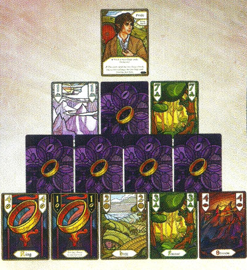

### Player Reference Card (玩家参考卡)
|||
| :--- | :--- |
| **Trick:** The lead player plays any **card**. Each other player plays **1 card but must follow suit, if** possible. The **highest card of the lead suit wins**. | **出牌：** 首位玩家打出任何**一张牌**。其他玩家各打**1张牌，但必须跟花色，如果**能。**领出花色的最大牌**获胜。 |
| **Exchange:** Pass **1 card facedown** to another player; the other player looks at it; then passes **1 card back**. | **交换：** 将**1张牌面向下**传给另一位玩家；另一位玩家看过后再传**1张牌回来**。 |
| **Victory:** All players must meet their **goal**. If anyone misses their **goal**, everyone loses the round: | **胜利：** 所有玩家必须达成他们的**目标**。如果任何人未能达成他们的**目标**，则所有人都输掉本回合： |
| **Short: Play round** | **短程：** **一轮出牌** |
| **Long: Play rounds until all characters are completed.** | **长程：** **若干轮出牌，直到所有角色都完成。** |

---

### Player Reference Card (玩家参考卡 - 续)
|||
| :--- | :--- |
| **Hills 1-8** | **山丘 1-8** |
| **Mountains 1-8** | **山脉 1-8** |
| **Forests 1-8** | **森林 1-8** |
| **Shadows 1-8** | **阴影 1-8** |
| **Rings 1-5** | **魔戒 1-5** |
| **You cannot lead with a Rings card until someone plays a Rings card into another trick** (or **Rings** is the only suit in the lead player's hand). | **你不能用一张魔戒牌领出**，**直到有人在另一轮中打出一张魔戒牌**（或**魔戒**是领牌者手中唯一的花色）。 |
| When you play the **1 of Rings, you may choose to win the trick.** The **1 of Rings must still follow the lead suit:** | 当你打出**魔戒1号牌**时，**你可以选择赢得该轮。** 魔戒1号牌**仍必须跟领出的花色：** |
| **Rank: The number on a card.** | **牌阶：卡牌上的数字。** |
| 143 | 143 |

---

### Reference for 2-Player Game (2人游戏参考)
|||
| :--- | :--- |
| The **2-player setup** is similar to the 3-player setup, with some changes. | **2人游戏设置**类似于3人游戏设置，但有所变化。 |
| One of the players will control a **shared open hand**, represented by a **card pyramid**. (See back of card.) | 其中一名玩家将控制一个**共享的明牌手牌**，以一个**牌金字塔**表示。（见卡牌背面。） |

---

|||
| :--- | :--- |
| The player dealt the **1 of Rings** will **control the pyramid**, including picking a character for it during **setup** and playing cards from the **pyramid hand** during tricks. | 拿到**魔戒1号牌**的玩家将**控制金字塔**，包括在**设置阶段**为其选择一个角色，并在打牌时从**金字塔手牌**中出牌。 |
| If the pyramid is dealt the **1 of Rings** (neither of the players has the **1 of Rings**), then the pyramid is **Frodo**, and the player to the right of it will **control it**. | 如果金字塔拿到了**魔戒1号牌**（两名玩家都没有魔戒1号牌），那么金字塔就是**弗罗多**，金字塔右侧的玩家将**控制它**。 |

---

### Old Man Willow (老柳头)
|||
| :--- | :--- |
| **Frodo and Sam beat first upon the tree-trunk where Pippin had lain:** then they **struggled frantically to pull open the jaws of the crack that held poor Merry:** It was quite useless. | **弗罗多和山姆先是敲打皮平躺过的树干：** 接着他们**拼命挣扎着拉开夹住可怜的梅里**的裂缝的巨口：这完全没有用。 |

---

### Old Man Willow (老柳头) - 事件规则
|||
| :--- | :--- |
| **Old Forest Event** | **老林事件** |
| Take the **8 Forests cards** and the **Old Man Willow** card and shuffle them into a **facedown Old Forest Deck**. | 取出 **8张森林牌**和**老柳头牌**，将它们洗入一个**面朝下的老林牌堆。** |
| Deal: **3 Players: 9 cards per player and 2 lost cards.** **4 Players: 7 cards per player and 2 lost cards.** | 发牌：**3名玩家：每人9张牌和2张遗失牌。** **4名玩家：每人7张牌和2张遗失牌。** |
| **Old Man Willow: For each trick, before the lead player has played their card, reveal the top card of the Old Forest Deck.** After all cards are played, if this **Forests** card is **higher than the rank of the winning card (not tied), no player wins the trick.** (**Old Man Willow wins it**.) The leader of this trick **leads again.** | **老柳头：每轮打牌时，在领牌者打出他们的牌之前，翻开老林牌堆的顶牌。** 所有牌打出后，如果这张**森林牌**的**牌阶高于赢得该轮的牌的牌阶（非平局），则没有玩家赢得该轮。**（**老柳头赢得该轮**。）该轮的领牌者**再次领牌。** |
| The **1 of Rings** can beat any **card** from the Old Forest Deck. | **魔戒1号牌**可以击败老林牌堆中的任何**牌**。 |
| 214 | 214 |

---

### Barrow-wights (古冢尸妖)
|||
| :--- | :--- |
| When he came to himself again, for a moment he could **recall** nothing except a sense of dread. Then suddenly he knew that he was imprisoned, caught hopelessly; he was in a barrow: A **Barrow-wight** had taken him, and he was probably already under the dreadful **spells** of the **Barrow-wights** about which whispered tales spoke: | 当他再次清醒过来时，他一时**回想**不起任何事，只感到一阵恐惧。然后他突然知道自己被困住了，无望地被抓住；他在一个古冢里：一个**古冢尸妖**抓住了他，他很可能已经处于那些低语传说中谈论的**古冢尸妖**的可怕**魔咒**之下： |

---

### Barrow-wights (古冢尸妖) - 事件规则
|||
| :--- | :--- |
| **on the Barrow-downs Event** | **在古冢岗事件** |
| **Set aside the 5 Rings cards from the main deck.** Shuffle the remaining cards and **deal 10 cards for 3 players or 5 cards to 4 players facedown into a facedown barrow deck.** Then **shuffle the Rings cards back** into the remaining main deck and deal: | **将5张魔戒牌从主牌堆中移开。** 洗混剩余的牌，然后**为3名玩家面朝下发10张牌，或为4名玩家发5张牌，放入一个面朝下的古冢牌堆。** 然后**将魔戒牌洗回**剩余的主牌堆并继续发牌： |
| **3 Players: 9 cards per player** **4 Players: 8 cards per player** | **3名玩家：每人9张牌** **4名玩家：每人8张牌** |
| **Tom Bombadil draws 5 of the barrow deck cards to his hand.** | **汤姆·邦巴迪尔将古冢牌堆中的5张牌抽到他的手牌中。** |
| 218 | 218 |

---

### The Nine (九戒灵)
|||
| :--- | :--- |
| There were **Nine Riders** at the water’s edge below, and **Frodo’s spirit quailed before the threat of their uplifted faces.** He knew of nothing that would prevent them from crossing as **easily** as he had done; and he felt that it was useless to try to escape over the **long path** from the Ford to the **edge** of Rivendell, if once the Riders crossed. | 下方的水边有**九个骑士**，**在他们抬起的面孔的威胁下，弗罗多的精神畏缩了。** 他知道没有什么能阻止他们像他一样**轻易**渡河；如果骑士们一旦渡河，他觉得试图从渡口逃到瑞文戴尔**边缘**的**长路径**上是徒劳的。 |

---

### The Nine (九戒灵) - 事件规则
|||
| :--- | :--- |
| **Flight to the Ford Event** | **奔向渡口事件** |
| When choosing characters, take the associated **Black Rider** card. | 选择角色时，拿取相应的**黑骑士**卡。 |
| **Frodo receives the Witch-king:** **Merry receives the Black Breath:** **Pippin receives the Wraith.** **Strider receives the Unseen.** **Sam receives the Terror.** | **弗罗多获得巫王：** **梅里获得黑之气息：** **皮平获得幽灵。** **神行客获得隐形。** **山姆获得恐惧。** |
| **Glorfindel and Bill the Pony do not receive a special Threat card.** | **格罗芬德尔和小马比尔不获得特殊的威胁卡。** |
| 233 | 233 |

---

### Saruman of Many Colours (多色萨鲁曼)
|||
| :--- | :--- |
| **‘For you have come, and that was all the purpose of my message. And here you will stay; Gandalf the Grey; and rest from journeys.** For **I am Saruman the Wise, Saruman Ring-maker; Saruman of Many Colours!’** | **‘因为你来了，这就是我传递消息的全部目的。你将留在这里，灰袍甘道夫；并停止旅行。** 因为**我是智者萨鲁曼，制戒者萨鲁曼；多色萨鲁曼！’** |

---

### Saruman of Many Colours (多色萨鲁曼) - 事件规则
|||
| :--- | :--- |
| **Saruman Event** | **萨鲁曼事件** |
| **Lead the first trick** (Delayed) | **由萨鲁曼领第一轮牌**（延迟） |
| **Goal:** Win a card of every rank **(1 through 8).** | **目标：** 赢得一张所有牌阶**（1到8）**的牌。 |
| 245 | 245 |

---

### The Doors of Durin (都灵之门)
|||
| :--- | :--- |
| ‘The words are in the **elven-tongue** of the West of Middle-earth in the Elder Days;’ answered Gandalf: ‘But they do not say anything of importance to us. They **only** say: **The Doors of Durin, Lord of Moria. Speak, friend, and enter:** And underneath small and faint is written: [Narvi made them. Celebrimbor of Hollin drew these signs.] | ‘这些文字是中土世界西方在远古时代的**精灵语**；’甘道夫回答：‘但它们没有说任何对我们重要的事情。它们**只**说：**摩瑞亚之王都灵之门。说吧，朋友，然后进入：** 在下面小而模糊地写着：[纳尔维制作了它们。霍林地的凯勒布林博描绘了这些符号。] |
| ‘What does it mean by **speak friend, and enter?**’ asked Merry: ‘That is plain enough;’ said Gimli ‘If you are a friend, speak the **password**, and the doors will open, and you can enter.’ | ‘**说吧，朋友，然后进入**是什么意思？’梅里问道：‘那再清楚不过了；’金雳说 ‘如果你是朋友，说出**口令**，门就会打开，你就可以进入。’ |

---

### The Doors of Durin (都灵之门) - 事件规则
|||
| :--- | :--- |
| **Moria Event** | **摩瑞亚事件** |
| **Gandalf must be chosen. Give this card to Gandalf:** | **必须选择甘道夫。将此卡交给甘道夫：** |
| **Friend Door:** **Goal:** Win at least **1 card in each of these suits: Hills, Mountains, and Forests.** | **友人之门：** **目标：** 至少赢得**山丘、山脉和森林这三种花色中的各1张牌。** |
| 313 | 313 |

---

### Balin's Tomb (巴林的坟墓)
|||
| :--- | :--- |
| The **Company of the Ring stood silent beside the tomb of Balin**. Frodo thought of **Bilbo and his long friendship with the dwarf; and of Balin’s visit to the Shire long ago.** In that **dusty** chamber in the mountains it seemed a thousand years ago and on the other side of the world. | **魔戒远征队静静地站在巴林的坟墓旁。** 弗罗多想起了**比尔博和他与矮人长久的友谊；以及巴林很久以前访问夏尔的事。** 在山中那个**布满尘土的**墓室里，那似乎已是一千年前，在世界的另一端发生的事。 |

---

### Balin's Tomb (巴林的坟墓) - 事件规则
|||
| :--- | :--- |
| **Moria Event** | **摩瑞亚事件** |
| **Gimli must be chosen. Give this card to Gimli as his Threat card.** | **必须选择金雳。将此卡作为他的威胁卡交给金雳。** |
| **Grief:** **Goal:** Gimli must win **four Mountains cards whose ranks are consecutive (e.g., 2, 3, 4, 5).** | **悲痛：** **目标：** 金雳必须赢得**四张牌阶连续的山脉牌（例如：2、3、4、5）。** |
| 314 | 314 |

---

### The Dark (黑暗)
|||
| :--- | :--- |
| They had marched as far as the **hobbits could endure without a rest** and all were thinking of a place where they could sleep, when suddenly the walls to right and left vanished. They seemed to have passed through some arched doorway into a **black and empty space.** There was a great draught of warmer air behind them, and before them the **cold darkness** was on their faces. They **halted and crowded anxiously together.** | 他们已经行进到了**霍比特人能承受的没有休息的极限**，所有人都想着一个可以睡觉的地方，这时突然左右两边的墙壁消失了。他们似乎穿过了一个拱门，进入了一个**黑色而空旷的空间。** 后面有一股温暖气流的大风，而面前的**寒冷黑暗**扑面而来。他们**停下脚步，焦虑地挤在一起。** |

---

### The Dark (黑暗) - 事件规则
|||
| :--- | :--- |
| **Moria Event** | **摩瑞亚事件** |
| **Aragorn must be chosen.** | **必须选择亚拉冈。** |
| **Keep all Threat cards facedown.** (Players reveal them when **they** are completed.) **All exchanges are simultaneous.** | **保持所有威胁卡面朝下。**（玩家在**它们**完成时才揭示。）**所有交换同时进行。** |
| **Fear:** **Goal:** Once it is completed, the **Long Dark** can be chosen **again.** | **恐惧：** **目标：** 一旦完成，**漫长的黑暗**可以**再次**被选择。 |
| 315 | 315 |

---

### The Bridge of Khazad-dum (凯萨督姆之桥)
|||
| :--- | :--- |
| It came to the **edge** of the fire, and the light faded as if a cloud had bent over it. Then with a rush it leaped across the fissure. The flames roared up to greet it, and wreathed about it; and a black smoke swirled in the air: Its **streaming mane kindled and blazed behind it.** In its right hand was a blade like a stabbing tongue of fire; in its left it held a whip of many thongs. **‘Ai! ai!’ wailed Legolas ‘A Balrog! A Balrog is come!’** | 它来到了火焰的**边缘**，光线减弱，仿佛一朵云笼罩了它。然后它猛地一跃，跳过了裂缝。火焰咆哮着迎接它，缠绕着它；黑色的烟雾在空气中盘旋：它**飘动的鬃毛被点燃，在身后燃烧。** 它的右手中是一把像刺出的火舌一样的刀刃；左手拿着一根多股的鞭子。**‘啊！啊！’莱戈拉斯哀嚎 ‘一个炎魔！炎魔来了！’** |

---

### The Bridge of Khazad-dum (凯萨督姆之桥) - 事件规则
|||
| :--- | :--- |
| **The Bridge Event** | **大桥事件** |
| **This cannot be played until all other Moria events have been completed.** **Gandalf must be chosen (use Gandalf, Servant of the Secret Fire).** | **必须在所有其他摩瑞亚事件完成后才能进行此事件。** **必须选择甘道夫（使用甘道夫，秘火之仆）。** |
| **Take the 8 Shadows cards and the Balrog card and shuffle them into a facedown Balrog Deck.** Deal: **3 Players: 9 cards per player and 2 lost cards.** **4 Players: 7 cards per player and 3 lost cards.** | **取出8张阴影牌和炎魔牌，并将它们洗入一个面朝下的炎魔牌堆。** 发牌：**3名玩家：每人9张牌和2张遗失牌。** **4名玩家：每人7张牌和3张遗失牌。** |
| **Durin's Bane:** Before each trick, **reveal cards from the Balrog Deck based on player count** (2 cards for 3 players, 3 cards for 4 players). **If the total of these cards' ranks is higher than the ranks of all the cards played in the trick (not equal), the players lose the round.** When the Balrog Deck runs out, **reshuffle it.** | **都灵的克星：** 在每轮打牌之前，**根据玩家人数翻开炎魔牌堆的牌**（3名玩家翻2张，4名玩家翻3张）。**如果这些牌的牌阶总和高于该轮中打出的所有牌的牌阶总和（非平局），则玩家输掉本回合。** 当炎魔牌堆用尽时，**重新洗牌。** |
| 316 | 316 |

---

### Blindfolded (蒙上眼睛)
|||
| :--- | :--- |
| **‘As was agreed I shall here blindfold the eyes of Gimli the Dwarf:** The others may walk free for a while; until we come nearer to our **dwellings**, down in Egladil in the Angle between the waters.’ | **‘正如所同意的，我将在这里蒙上矮人金雳的眼睛：** 其他人可以自由行走一会儿；直到我们更接近我们在水域之间的安格尔的埃格拉迪尔的**住所**。’ |

---

### Blindfolded (蒙上眼睛) - 事件规则
|||
| :--- | :--- |
| **Blindfolded Event** | **蒙上眼睛事件** |
| **Gimli plays his cards facedown into the tricks.** He must **state the suit of his card but not the rank.** **Reveal Gimli's card after all characters have played cards into the trick** and **determine the winner of the trick normally.** | **金雳将他的牌面朝下打入该轮。** 他必须**说明他牌的花色但不能说明牌阶。** **在所有角色都打完牌后揭示金雳的牌**，并**照常决定该轮的赢家。** |
| 320 | 320 |

---

### The Mirror (魔镜)
|||
| :--- | :--- |
| But suddenly the Mirror went altogether dark, as dark as if a hole had opened in the world of sight, and Frodo looked into **emptiness**. In the black abyss there appeared a **single Eye that slowly grew, until it filled nearly all the Mirror:** So terrible was it that Frodo stood rooted, unable to cry out or to withdraw his gaze. The Eye was rimmed with fire, but was itself glazed, **yellow** as a cat’s, watchful and intent, and the black slit of its pupil opened on a pit, a window into nothing: | 但是魔镜突然完全变黑了，黑得就像视觉世界中开了一个洞，弗罗多看向了**虚无**。在黑色的深渊中出现了一只**单眼，它慢慢变大，直到几乎占据了整个魔镜：** 它如此可怕，以至于弗罗多定在原地，无法喊叫或移开目光。这只眼睛被火光环绕，但本身却是**黄色**的，像猫的眼睛一样，警惕而专注，它瞳孔的黑色缝隙通向一个深渊，一个通往虚无的窗户： |

---

### The Mirror (魔镜) - 事件规则
|||
| :--- | :--- |
| **Mirror of Galadriel Event** | **加拉德瑞尔之镜事件** |
| At the start of setup, **shuffle the characters and deal 1 card to each player.** **Deal each player 4 cards.** Players **simultaneously give 1 card to each other player and keep the rest.** **Deal each player another 4 cards.** Players **simultaneously give 1 card to each player and keep the rest.** Next, **deal the remaining cards** (the rest to each player and 1 lost card). **Players do not give any of these away.** Finally, finish setup normally, starting with the player to **Frodo's left.** | 在设置开始时，**洗混角色卡并给每位玩家发1张。** **给每位玩家发4张牌。** 玩家**同时给其他每位玩家1张牌并保留其余的。** **再给每位玩家发4张牌。** 玩家**同时给每位玩家1张牌并保留其余的。** 接下来，**发完剩余的牌**（其余的牌给每位玩家，还有1张遗失牌）。**玩家不传出这些牌中的任何一张。** 最后，照常完成设置，从**弗罗多左边**的玩家开始。 |
| 324 | 324 |

---

### The Anduin (安都因河)
|||
| :--- | :--- |
| ‘**Hoy there, Aragorn!**’ shouted Boromir; as his boat bumped into the leader: ‘This is madness! We cannot dare the Rapids by night! But no **boat** can live in Sarn Gebir; be it night or **day!**’ ‘**Back, back!**’ cried Aragorn: ‘Turn! Turn if you can! He drove his paddle into the water, trying to hold the **boat** and bring it round. ‘I am out of my **reckoning**;’ he said to Frodo: ‘I did not know that we had come so far: Anduin flows faster than I thought. **Sarn Gebir** must be close at hand already:’ | ‘**喂，亚拉冈！**’波罗莫喊道；他的船撞上了领头的船：‘这太疯狂了！我们不能在晚上冒险过急流！但在萨恩盖比尔，无论是白天还是**黑夜**，没有**船**能活下来！’ ‘**回去，回去！**’亚拉冈喊道：‘转弯！如果可以的话，转弯！’ 他把桨插进水中，试图稳住**船**并让它转过来。‘我**估算**错了；’他对弗罗多说：‘我不知道我们已经走了这么远：安都因河比我想象的流得更快。**萨恩盖比尔**肯定已经近在眼前了：’ |

---

### The Anduin (安都因河) - 事件规则
|||
| :--- | :--- |
| **The Anduin Event** | **安都因河事件** |
| Before dealing main deck cards: | 在分发主牌堆的牌之前： |
| **3 players: Add the 1-6 Rivers cards to the main deck before dealing each player 14 cards and 1 lost card.** | **3名玩家：将1-6号河流牌加入主牌堆，然后给每位玩家发14张牌和1张遗失牌。** |
| **4 players: Add the 1-8 Rivers cards to the main deck before dealing each player 11 cards and 1 lost card.** | **4名玩家：将1-8号河流牌加入主牌堆，然后给每位玩家发11张牌和1张遗失牌。** |
| **The Great River:** **Rivers cards win any trick they are played into, even if they are not the lead suit.** If multiple Rivers cards are played, **the Rivers card of the highest rank wins the trick.** Rivers cards still lose to the **1 of Rings** card. | **大河：** **河流牌可以赢得任何打入的牌轮，即使它们不是领出的花色。** 如果打出了多张河流牌，**牌阶最高的河流牌赢得该轮。** 河流牌仍然输给**魔戒1号牌**。 |
| 328 | 328 |

---

### Breaking of the Fellowship (远征队解散)
|||
| :--- | :--- |
| There was no answer: Frodo did not even hear his cries. He was already far away; leaping blindly up the **path** to the hill-top. Terror and grief shook him, seeing in his thought the mad fierce face of Boromir; and his burning eyes. | 没有回应：弗罗多甚至没有听到他的呼喊。他已经走远了；盲目地沿着**小路**跳向山顶。恐怖和悲伤震撼着他，在他的思绪中看到了波罗莫疯狂而凶猛的脸；以及他燃烧的眼睛。 |

---

### Breaking of the Fellowship (远征队解散) - 事件规则
|||
| :--- | :--- |
| **Breaking of the Fellowship Event** | **远征队解散事件** |
| **Characters are divided into 2 groups.** **Red characters use the Burdened side of the character card.** | **角色被分成2个小组。** **红色角色使用角色卡的“重负”面。** |
| **Group 1:** Frodo*, Boromir son of Denethor, Samwise Gamgee, Aragorn son of Arathorn | **第1组：** 弗罗多*、迪耐瑟之子波罗莫、山姆卫斯·甘吉、亚拉松之子亚拉冈 |
| **Group 2:** Meriadoc Brandybuck*, Peregrin Took*, Legolas Greenleaf, Gimli son of Gloin | **第2组：** 梅里雅达克·烈酒鹿*、皮瑞格林·图克*、莱戈拉斯·绿叶、葛罗音之子金雳 |
| **The player with the One Ring picks a group each round and picks their character first.** | **拥有至尊魔戒的玩家每轮选择一个小组，并首先选择他们的角色。** |
| 338 | 338 |

---

### 章节结束信息
|||
| :--- | :--- |
| **You've finished all of the chapters, but the game is not over. The end of the rulebook includes a way to play the game as much as you would like.** Included below are **2 more gift cards to try in this new game mode** using many of the other cards in the game. | **您已经完成了所有章节，但游戏尚未结束。规则书的末尾包含了一种可以随心所欲玩游戏的方式。** 下面包含了**另外2张可以在这种新游戏模式中尝试的礼品卡**，这些卡使用了游戏中的许多其他卡牌。 |
| 346 | 346 |

---

### The Road goes ever on and on (路途永不止息)

    
Down from the door where it began
Now far ahead the Road has gone,
And I must follow, if I can,
Pursuing it with weary feet
Until it joins some larger way
Where many paths and errands meet.
And whither then? I cannot say.

    
从它起始的门下延伸而去，
如今那条路已远远伸向前方。
而我必须追随，若我仍能，
以疲惫的脚步将它追逐，
直至它汇入更宽广的途径，
在那里许多小径与使命相遇。
而它将通向何方？我却不能言说。

---
