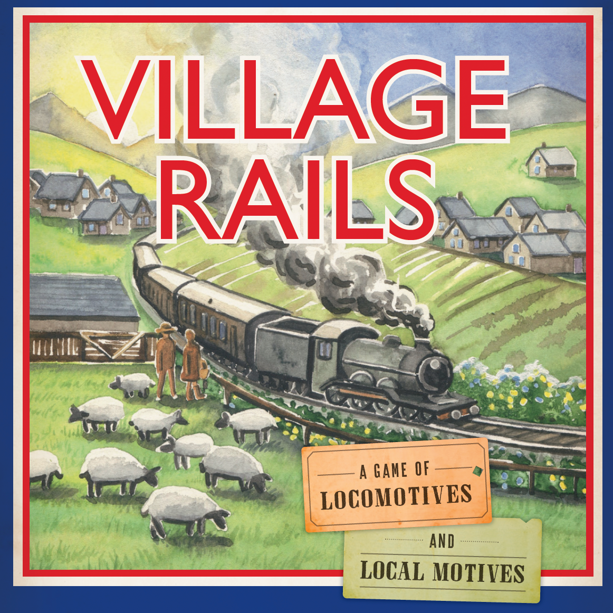
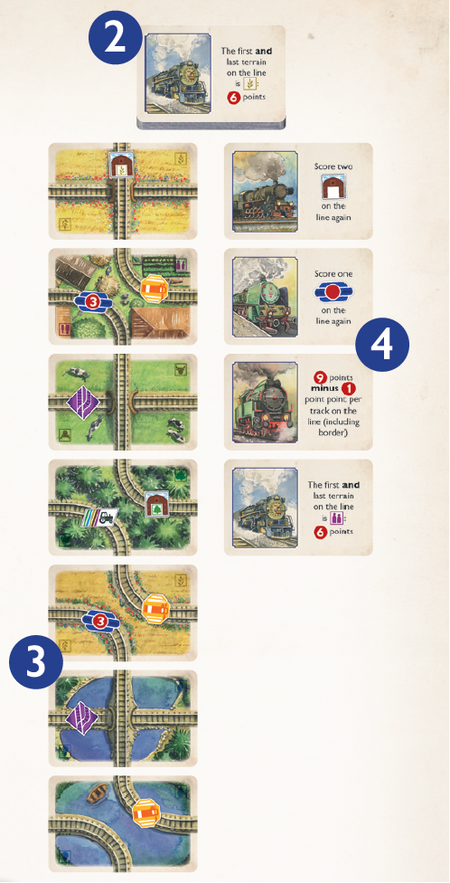
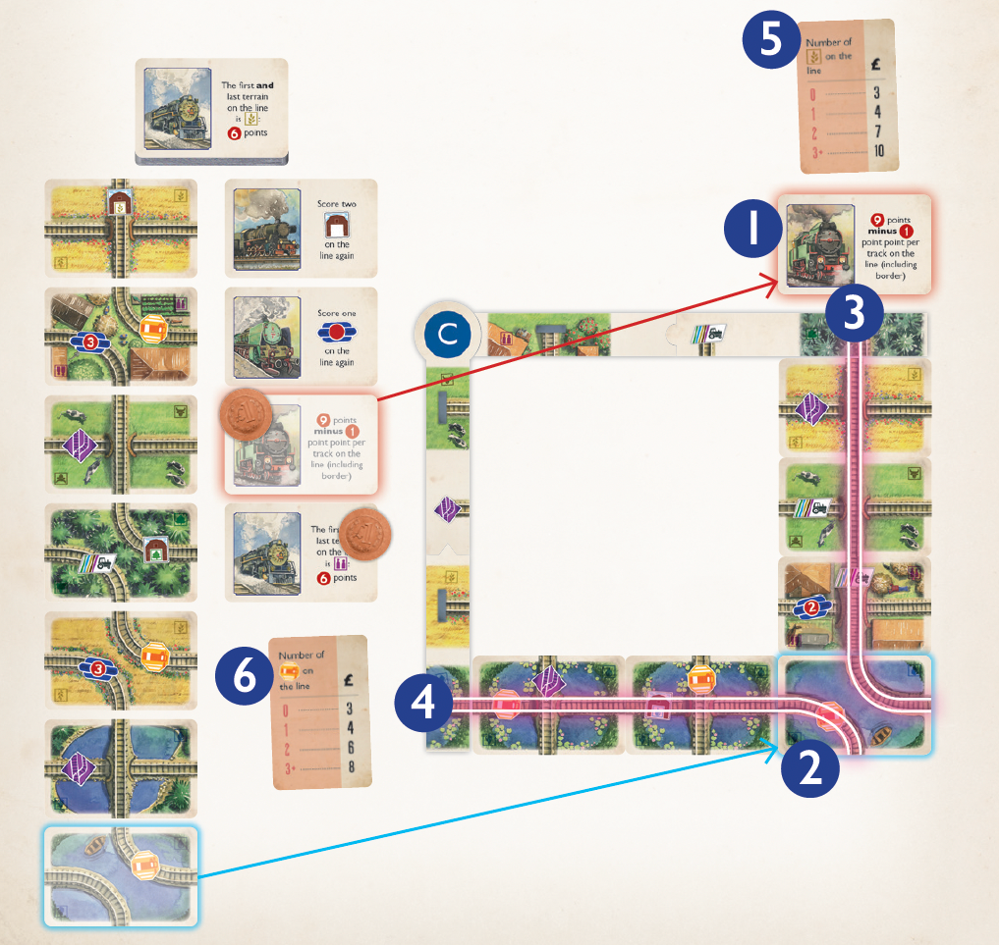
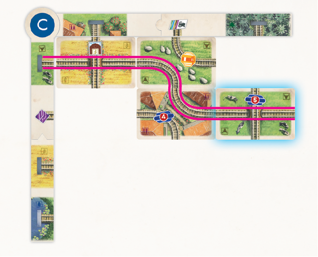
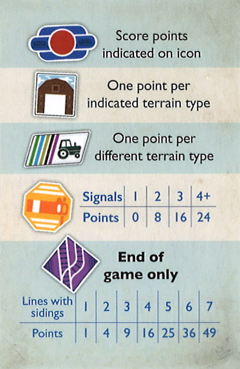
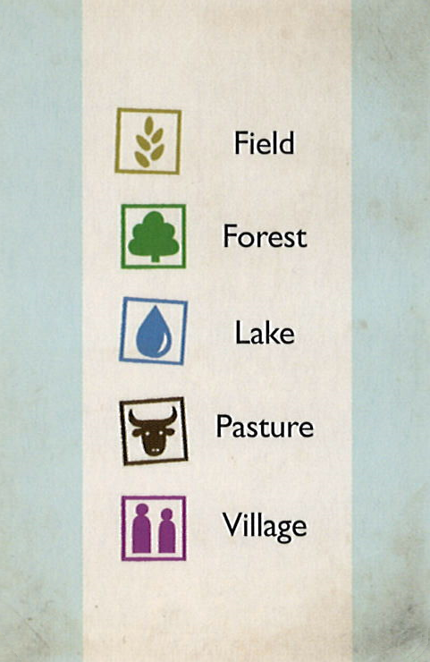

<!-- size: 16:9 -->

    

        <h1>村庄铁路（Village Rails）</h1>
    

    

        
    

---
### 游戏简介

在宁静的英格兰乡村，生活如几个世纪以来一样，平静地持续着。你的任务是前往这片绿色而宜人的土地的每一个角落，承载着现代化的希望，满足当地居民各种奇特的要求，并开启蒸汽时代。

<footer>

 适合 2–4 名玩家，最佳体验为 3 人。

</footer>

---
### 设置

1.  每位玩家随机抽取一块**主角块**。然后，玩家拿取所有与角块背面字母相同的**边缘角块**，并将其摆成一个倒“L”形，放在自己面前。任何未使用的角块都放回盒中。
2.  将**铁路卡**洗匀，**旅行面**朝上，放在游戏区中央，形成一个牌库。
3.  从牌库顶部抽出一张铁路卡，**轨道面**朝上，放在铁路牌库旁边，形成**轨道市场**。重复此步骤，直到轨道市场中有七张卡为止。
4.  从牌库顶部抽出一张铁路卡，**旅行面**朝上，放在铁路牌库的另一侧，形成**旅行市场**。重复此步骤，直到旅行市场中有四张卡为止。

---

    

    
5.  将**硬币**放在铁路牌库附近，作为公共储备。每位玩家获得总价值 £5 的硬币。  
6.  将**终点卡**洗匀，面朝下放成牌库。然后，每位玩家发三张终点卡。你可以查看自己的终点卡，但要对其他玩家保密。  
7.  每位玩家拿取一个**计分盘**，并将其设为零分。  
8.  每位玩家拿取一张**参考卡**。  
9.  拥有字母顺序最靠前的角块的玩家，首先开始游戏。

    

    

        
    

---
### 游戏玩法

#### 概述

《村庄铁路》是一款**版图构建卡牌游戏**。在游戏中，你的个人版图由角块框定。在这个 $3 \times 4$ 的区域内，你将放置铁路卡作为**轨道**，构建你的个人铁路网络。在角块外部，你将放置铁路卡作为**旅行**，这将为你带来分数。

你的角块代表了七条铁路线的起点。通过放置轨道，你将延伸这些线路。当一条线路从角块一直延伸到版图的边缘时，这条线路便**完成**了。完成一条线路后，你将为所有相关的旅行和特色设施得分，并打出一张终点卡以获得金钱。

当所有玩家都进行了十二个回合后，游戏结束。得分最高的玩家获胜。

---
### 玩家回合

在你的回合中，你**必须**建造轨道。

你也可以**计划一次旅行**，这可以在建造轨道之前或之后进行。

当你结束回合后，由你左侧的玩家进行他们的回合。

    

---
#### 计划一次旅行

* 要计划一次旅行，你需要花费 £3，将其放回公共储备。如果你付不起，就不能计划旅行。
* 从旅行市场拿取一张旅行卡。拿取离铁路牌库最远的那张卡是免费的。
* 要拿取其他任何卡，你必须在每张比你所选卡更远的卡上放置 £1。
* 你拿取卡时，获得卡上已有的所有钱。
* 拿走卡后，将更靠近牌库的卡滑动以填补空位。然后，将铁路牌库最上面的一张卡**旅行面**朝上放入旅行市场中离牌库最近的空位。旅行市场中应始终有四张卡可用。
* 接下来，将旅行卡分配给一条铁路。只需将旅行卡放在你某个角块上的一条线路起点旁边。
* 一条线路不能分配超过两张旅行卡。已完成的线路也不能再分配旅行卡。已完成的线路旁边会有一张面朝下的终点卡作为标记。

---
#### 建造轨道

* 从轨道市场拿取一张轨道卡。拿取离铁路牌库最远的那张卡是免费的。
* 要拿取其他任何卡，你必须在每张比你所选卡更远的卡上放置 £1。
* 你拿取卡时，获得卡上已有的所有钱。
* 拿走卡后，将更靠近牌库的卡滑动以填补空位。然后，将铁路牌库最上面的一张卡**轨道面**朝上放入轨道市场中离牌库最近的空位。轨道市场中应始终有七张卡可用。
* 接下来，将轨道放入你版图中十二个空格中的一个。你必须将其放置在一个空位上，并且该空位必须与至少一个角块或轨道相邻。
* 你必须将轨道横向放置，但可以旋转 180 度。

#### 缺钱了？

如果你没钱了，你就不能计划旅行 ，并且必须建造离铁路牌库最远的那张轨道卡。要赚更多钱，你可以通过完成铁路来打出终点卡，或者从市场上拿取有钱的轨道或旅行卡。

---
### 完成线路

当一条轨道从角块连续延伸到你版图的边缘（没有角块的那一侧）时，这条线路就完成了。当一条线路完成后，为所有相关的旅行和特色设施计分，并打出一张终点卡。当你得分时，相应地调整你的计分盘。分数是公开信息。

在为旅行和终点卡计分时，线路起点角块上的地形类型或特色设施也被视为该线路的一部分。

如果你同时完成了多条线路，你可以选择先结算哪一条。

    

---
#### 旅行计分

为分配给该已完成线路的任何旅行计分。每张旅行卡根据已完成线路的特性（包括角块）来计分，具体细节在其卡上。

有些旅行卡的计分条件是“该线路上至少有一种（地形类型），并且其数量少于任何其他类型”。如果该线路上至少有该指定类型的一个，并且所有其他在场地形类型的数量都比它多，那么这张卡才能得分。

---
#### 特色设施计分

为线路上除**侧线**以外的任何特色设施计分。
* **谷仓**：每个谷仓代表一种地形类型。谷仓根据线路上该指定地形类型的轨道数量来得分，每有一个得一分。
* **农场**：每个农场根据线路上不同地形类型的数量来得分，每有一种得一分。一个农场最多能得五分。
* **站点**：每个站点根据其图标所示的分数来得分。
* **信号**：信号根据线路上信号的总数来计分。
* **侧线**：侧线只在游戏结束时计分。

---
### 使用终点卡

为旅行和特色设施计分后，从你手中选择并打出一张终点卡。根据已完成线路的特性（包括角块），从公共储备中获得卡上所示的金额。

接下来，将所有已计分的旅行卡以你选择的任何顺序，**旅行面**朝上放回铁路牌库底部。将打出的终点卡面朝下放在已计分线路的起点旁边。这作为一个提醒，表明该线路已完成，你不能再分配任何旅行卡给它。

最后，如果你还没有完成所有七条线路，从终点卡牌库中抽一张新的终点卡。终点卡至少会让你获得 £3。

---
### 游戏结束

当所有玩家都进行了十二个回合并填满了他们版图中的所有空格后，游戏结束。

    
* 玩家根据拥有至少一个**侧线**的不同线路数量来得分。
* 最后，玩家每有剩余 £3，得一分。
* 得分最高的玩家获胜。如果出现平局，拥有最多金钱的玩家获胜。如果仍然平局，则平局的玩家共享胜利。

    

    

---
### 游戏配件

* 38 张终点卡 
* 4 张参考卡 
* 4 个计分盘 
* 12 个边缘角块 
* 44 枚硬币 (32枚 £1，12枚 £5) 
* 80 张铁路卡 
    * **轨道面**：当铁路卡正面朝上时，它被视为轨道。每张轨道卡有两条铁路。一条或两条线路上可能有特色设施。此外，每张轨道卡都有一个地形类型：**田野**、**森林**、**牧场**、**湖泊**或**村庄**。
    * **旅行面**：当铁路卡正面朝上时，它被视为旅行。每张旅行卡都会告诉你当其铁路线路完成时如何计分。
* 4 个主角块 